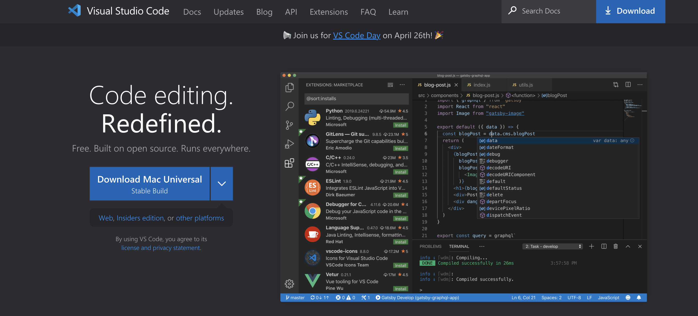
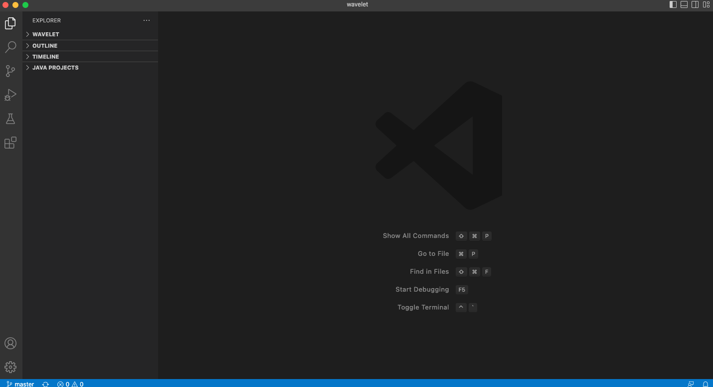
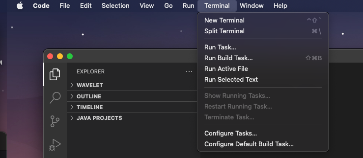
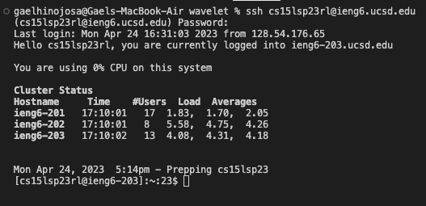
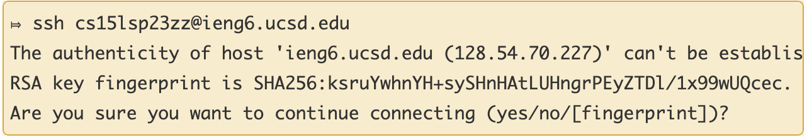
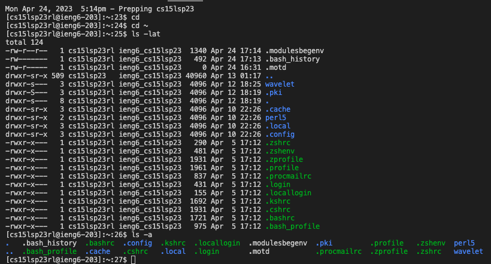

## Installing VSCode

1. To download visual studio code, first you will need to go to this link to download it https://code.visualstudio.com/	 
above this is a picture of what it should look like when you press the link. Just download it onto your device whether it be Mac or Windows

2. Once you downloaded Visual Studio Code, it will look like this after you do the tutorial steps that VS Code will show
you after opening it for the first time

3. To get the terminal for Mac, you just need to be on the tab and then go the top left of your screen where it says Terminal and when you 
click on that just click on New Terminal which will pop up in VS Code at the bottom

## Remotely Connecting

1. Once you have your CSE15L account you are going to type in ssh cse15lsp23XX@ieng6.ucsd.edu on the terminal except you are going to replace 
the XX with your own two letters that you were given

2. If it isn’t your first time doing you will just type in the password that you wrote for the CSE15L account (This is what is given above)

3. If this is your first time, you’ll be asked whether or not you want to continue using it. The picture above is what it will look like after 
typing in your CSE15L username. You are going to type yes which will then proceed to ask you for your password

4. Type the password you wrote for your CSE15L account. If it shows that you are not typing anything you are it is just invisible

## Trying Out Some Commands

1. After you login into the VS Code terminal, you can try out some of the commands

2. You could write cd, cd ~, ls -lat, and ls -a just to name a few

3. cd and cd ~ don’t seem to do anything when you type it into the terminal but ls -lat and ls -a both seem to list out paths

4. A useful tip you could use after your done with writing down some of the commands is CTRL + d which will close the remote server in the terminal
